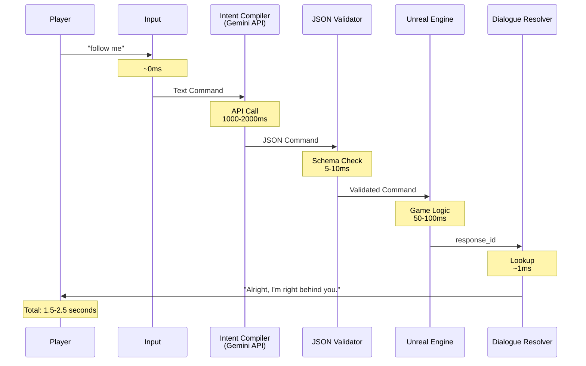

# AI Game Companion - Architecture & Integration Guide

## System Architecture


## Processing Flow & Timing Analysis

### Complete Pipeline Flow



### Detailed Component Timing

| Component | Operation | Time | Notes |
|-----------|-----------|------|-------|
| **1. Input Capture** | Receive text | <1ms | Instant |
| **2. Intent Compiler** | Gemini API call | 1000-2000ms | Network + LLM processing |
| | JSON parsing | 1-5ms | Python json.loads() |
| **3. Schema Validator** | Validation | 5-10ms | jsonschema library |
| | Retry (if needed) | +1000-2000ms | Per retry attempt |
| **4. Unreal Engine** | State check | 10-20ms | Memory lookup |
| | Command execution | 30-80ms | Game logic |
| **5. Dialogue Resolver** | Lookup | <1ms | Dictionary access |
| **Total (Success)** | | **1.5-2.5s** | Typical case |
| **Total (1 Retry)** | | **2.5-4.5s** | If JSON invalid |

### Performance Breakdown

**Bottleneck:** Gemini API call (~80-90% of total time)

**Optimization Opportunities:**
- ✅ **Caching:** Cache common commands (could reduce to <100ms)
- ✅ **Streaming:** Use Gemini streaming API (perceived latency reduction)
- ✅ **Local LLM:** Run smaller model locally (reduce to 200-500ms)
- ✅ **Prediction:** Pre-generate likely commands

## Unreal Engine Integration Guide

### Integration Architecture

```
Unreal Engine (C++)
├── AI Companion System
│   ├── HTTP Client (REST API)
│   ├── Command Queue (Async)
│   ├── State Manager
│   └── Dialogue Display
│
└── Python Backend (This Prototype)
    ├── Flask/FastAPI Server
    ├── Intent Compiler
    ├── Mock UE → Real UE Bridge
    └── Response Handler
```

### Option 1: HTTP REST API (Recommended)

#### Step 1: Convert Python to Web Service

Create `server.py`:

```python
from flask import Flask, request, jsonify
from intent_compiler import compile_intent
from mock_unreal import get_unreal_engine
from dialogue_resolver import resolve_dialogue

app = Flask(__name__)
ue = get_unreal_engine()

@app.route('/api/command', methods=['POST'])
def process_command():
    """
    Endpoint for UE to send text commands
    
    Request: {"text": "follow me", "companion_id": "companion_01"}
    Response: {"success": true, "dialogue": "...", "response_id": "..."}
    """
    data = request.json
    text_input = data.get('text', '')
    
    # 1. Compile intent
    command = compile_intent(text_input)
    if not command:
        return jsonify({
            'success': False,
            'error': 'Failed to compile intent'
        }), 400
    
    # 2. Execute in UE (replace mock with real UE bridge)
    response = ue.execute_command(command)
    
    # 3. Resolve dialogue
    dialogues = resolve_dialogue(response)
    
    return jsonify({
        'success': True,
        'dialogue': dialogues[0],
        'response_id': response['actions'][0]['response_id'],
        'command_id': response['command_id']
    })

if __name__ == '__main__':
    app.run(host='0.0.0.0', port=5000)
```

**Install Flask:**
```bash
pip install flask flask-cors
```

**Run server:**
```bash
python server.py
```

#### Step 2: Unreal Engine HTTP Client (C++)

Create `AICompanionClient.h`:

```cpp
#pragma once

#include "CoreMinimal.h"
#include "Http.h"
#include "Json.h"
#include "JsonUtilities.h"

DECLARE_DELEGATE_TwoParams(FOnCommandResponse, bool /*bSuccess*/, FString /*Dialogue*/);

class FAICompanionClient
{
public:
    FAICompanionClient();
    
    /**
     * Send text command to AI backend
     * @param TextCommand - Player's text input (e.g., "follow me")
     * @param OnResponse - Callback when response received
     */
    void SendCommand(const FString& TextCommand, FOnCommandResponse OnResponse);
    
private:
    void OnResponseReceived(
        FHttpRequestPtr Request,
        FHttpResponsePtr Response,
        bool bWasSuccessful,
        FOnCommandResponse Callback
    );
    
    FString ServerURL = TEXT("http://localhost:5000/api/command");
};
```

Create `AICompanionClient.cpp`:

```cpp
#include "AICompanionClient.h"

FAICompanionClient::FAICompanionClient()
{
    // Initialize HTTP module
    FHttpModule::Get();
}

void FAICompanionClient::SendCommand(const FString& TextCommand, FOnCommandResponse OnResponse)
{
    // Create HTTP request
    TSharedRef<IHttpRequest> Request = FHttpModule::Get().CreateRequest();
    Request->SetURL(ServerURL);
    Request->SetVerb(TEXT("POST"));
    Request->SetHeader(TEXT("Content-Type"), TEXT("application/json"));
    
    // Build JSON payload
    TSharedPtr<FJsonObject> JsonObject = MakeShareable(new FJsonObject);
    JsonObject->SetStringField(TEXT("text"), TextCommand);
    JsonObject->SetStringField(TEXT("companion_id"), TEXT("companion_01"));
    
    FString JsonString;
    TSharedRef<TJsonWriter<>> Writer = TJsonWriterFactory<>::Create(&JsonString);
    FJsonSerializer::Serialize(JsonObject.ToSharedRef(), Writer);
    
    Request->SetContentAsString(JsonString);
    
    // Bind response callback
    Request->OnProcessRequestComplete().BindRaw(
        this,
        &FAICompanionClient::OnResponseReceived,
        OnResponse
    );
    
    // Send request (async)
    Request->ProcessRequest();
    
    UE_LOG(LogTemp, Log, TEXT("Sent command to AI: %s"), *TextCommand);
}

void FAICompanionClient::OnResponseReceived(
    FHttpRequestPtr Request,
    FHttpResponsePtr Response,
    bool bWasSuccessful,
    FOnCommandResponse Callback)
{
    if (!bWasSuccessful || !Response.IsValid())
    {
        UE_LOG(LogTemp, Error, TEXT("AI request failed"));
        Callback.ExecuteIfBound(false, TEXT(""));
        return;
    }
    
    // Parse JSON response
    FString ResponseString = Response->GetContentAsString();
    TSharedPtr<FJsonObject> JsonObject;
    TSharedRef<TJsonReader<>> Reader = TJsonReaderFactory<>::Create(ResponseString);
    
    if (FJsonSerializer::Deserialize(Reader, JsonObject))
    {
        bool bSuccess = JsonObject->GetBoolField(TEXT("success"));
        FString Dialogue = JsonObject->GetStringField(TEXT("dialogue"));
        
        UE_LOG(LogTemp, Log, TEXT("AI Response: %s"), *Dialogue);
        Callback.ExecuteIfBound(bSuccess, Dialogue);
    }
    else
    {
        UE_LOG(LogTemp, Error, TEXT("Failed to parse AI response"));
        Callback.ExecuteIfBound(false, TEXT(""));
    }
}
```

#### Step 3: Usage in Game Code

```cpp
// In your companion AI controller or component

void ACompanionAIController::ProcessPlayerCommand(const FString& TextCommand)
{
    // Show "thinking" indicator
    ShowThinkingIndicator(true);
    
    // Send to AI backend
    AIClient.SendCommand(
        TextCommand,
        FOnCommandResponse::CreateUObject(this, &ACompanionAIController::OnAIResponse)
    );
}

void ACompanionAIController::OnAIResponse(bool bSuccess, FString Dialogue)
{
    // Hide "thinking" indicator
    ShowThinkingIndicator(false);
    
    if (bSuccess)
    {
        // Display dialogue
        DisplayDialogue(Dialogue);
        
        // Execute the actual follow behavior
        // (This would be your existing AI logic)
        StartFollowingPlayer();
    }
    else
    {
        // Handle error
        DisplayDialogue(TEXT("I didn't understand that."));
    }
}
```

### Option 2: Blueprint Integration

Create a Blueprint Function Library:

**AICompanionBlueprintLibrary.h:**

```cpp
#pragma once

#include "Kismet/BlueprintFunctionLibrary.h"
#include "AICompanionBlueprintLibrary.generated.h"

DECLARE_DYNAMIC_DELEGATE_TwoParams(FOnAICommandResponse, bool, bSuccess, FString, Dialogue);

UCLASS()
class UAICompanionBlueprintLibrary : public UBlueprintFunctionLibrary
{
    GENERATED_BODY()
    
public:
    /**
     * Send text command to AI companion system
     * @param TextCommand - The player's text input
     * @param OnResponse - Callback when AI responds
     */
    UFUNCTION(BlueprintCallable, Category = "AI Companion")
    static void SendAICommand(
        const FString& TextCommand,
        FOnAICommandResponse OnResponse
    );
};
```

**Usage in Blueprints:**
1. Add "Send AI Command" node
2. Connect "On Response" event
3. Display dialogue in UI widget
4. Execute companion behavior

### Option 3: Direct Python Integration (Advanced)

Use Unreal's Python API:

```cpp
// In your C++ code
#include "PythonScriptPlugin.h"

FString RunPythonCommand(const FString& TextCommand)
{
    FString PythonScript = FString::Printf(TEXT(
        "from run import run_pipeline\n"
        "result = run_pipeline('%s')\n"
        "result"
    ), *TextCommand);
    
    FPythonCommandEx PythonCommand;
    PythonCommand.Command = PythonScript;
    
    IPythonScriptPlugin::Get()->ExecPythonCommand(*PythonCommand.Command);
    
    // Parse result...
}
```

## Production Integration Checklist

### Backend Setup

- [ ] Convert prototype to web service (Flask/FastAPI)
- [ ] Add authentication (API keys)
- [ ] Implement rate limiting
- [ ] Add request queuing for high load
- [ ] Set up logging and monitoring
- [ ] Deploy to cloud (AWS/GCP/Azure)
- [ ] Configure HTTPS/SSL
- [ ] Add health check endpoint

### Unreal Engine Setup

- [ ] Create HTTP client module
- [ ] Implement async request handling
- [ ] Add timeout handling (5-10 seconds)
- [ ] Create fallback responses for failures
- [ ] Add "thinking" UI indicator
- [ ] Implement command queue (prevent spam)
- [ ] Add retry logic (1-2 retries)
- [ ] Cache common responses

### Performance Optimization

- [ ] Implement response caching
- [ ] Use Gemini streaming API
- [ ] Pre-generate common commands
- [ ] Add local fallback for simple commands
- [ ] Optimize JSON parsing
- [ ] Use connection pooling
- [ ] Implement request batching

### Testing

- [ ] Test with 100+ concurrent requests
- [ ] Measure average response time
- [ ] Test network failure scenarios
- [ ] Validate all edge cases
- [ ] Load test the backend
- [ ] Test in-game integration

## Example: Complete UE Integration Flow

```
1. Player speaks: "follow me"
   ↓ (Speech-to-text - external)
   
2. UE receives text: "follow me"
   ↓ (Show "thinking" indicator)
   
3. UE HTTP Request → Python Backend
   POST http://localhost:5000/api/command
   Body: {"text": "follow me", "companion_id": "companion_01"}
   ↓ (1.5-2.5 seconds)
   
4. Python Backend Response
   {
     "success": true,
     "dialogue": "Alright, I'm right behind you.",
     "response_id": "RESP_FOLLOW_ACCEPT",
     "command_id": "cmd_001"
   }
   ↓
   
5. UE Receives Response
   - Hide "thinking" indicator
   - Display dialogue in UI
   - Execute follow behavior
   - Update companion state
```

## Timing Expectations

| Scenario | Expected Time | User Experience |
|----------|---------------|-----------------|
| **Best Case** | 1.2-1.5s | Feels responsive |
| **Typical** | 1.5-2.5s | Acceptable for voice commands |
| **With Retry** | 2.5-4.5s | Noticeable delay, show indicator |
| **Network Issue** | 5-10s | Timeout, show error |

## Recommended UX Patterns

1. **Show "Thinking" Indicator:** Display visual feedback immediately
2. **Timeout Handling:** 5-10 second timeout with fallback message
3. **Queue Commands:** Prevent multiple simultaneous requests
4. **Cache Responses:** Store recent responses for instant replay
5. **Fallback Dialogue:** Have default responses for failures

---

**Next Steps:**
1. Set up Flask server with the prototype
2. Create UE HTTP client module
3. Test end-to-end integration
4. Optimize for production use
